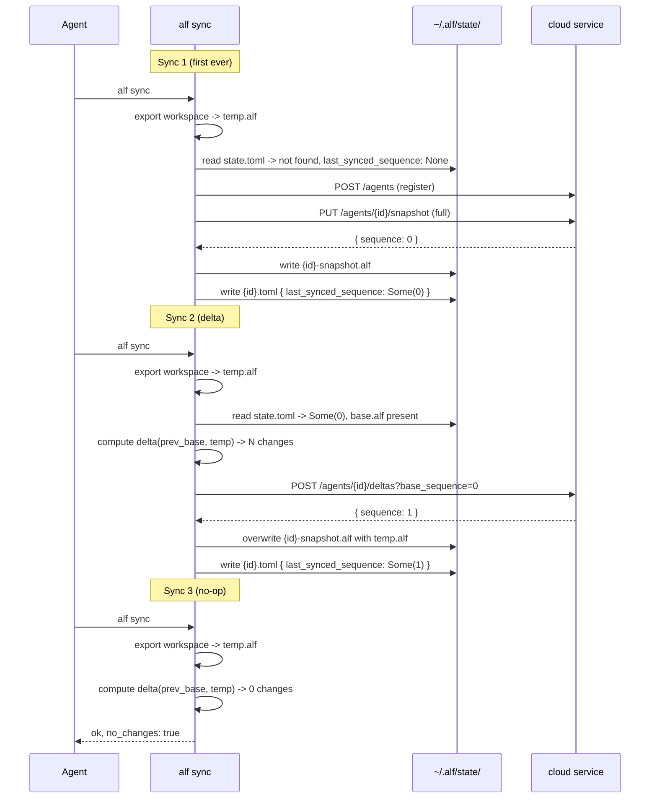
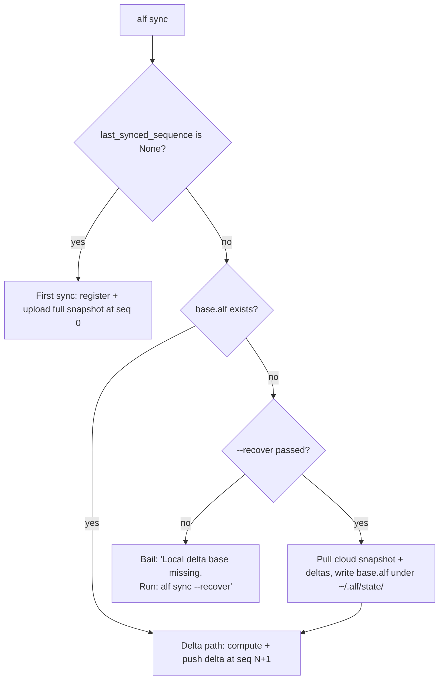

# How `alf sync` works

This is the canonical reference for how the ALF CLI synchronises an agent's
workspace with the cloud sync service. It documents the data model, the
happy path, and every reachable corner case — particularly the cases that
arise on **ephemeral runtimes** where the rootfs may have been wiped between
boots.

If you are debugging a production sync failure, jump straight to the
[Ephemeral-runtime cases](#ephemeral-runtime-cases-the-primary-failure-surface)
or the [Operator runbook](#operator-runbook).

## 1. Overview and vocabulary

| Term | Meaning |
| --- | --- |
| **Agent** | A persistent identity (a UUID) whose memory and context are tracked in the cloud. |
| **Workspace** | The directory the runtime reads and writes (e.g. `/config/.openclaw/workspace`). The live source of truth for the agent's state. |
| **Snapshot** | A complete `.alf` archive of the agent's state at a point in time. |
| **Delta** | An `.alf-delta` archive describing the *changes* since a base snapshot. |
| **Sequence** | A monotonically increasing `u64` assigned by the cloud service. The first snapshot is at sequence 0; each subsequent delta advances the sequence by 1. |
| **Local base** | A copy of the last successfully synced snapshot, kept under `~/.alf/state/{agent_id}-snapshot.alf`. Used as the base for computing the next delta. |
| **State file** | `~/.alf/state/{agent_id}.toml`. Records the sequence number of the last successful sync, plus informational metadata. |

## 2. The model in one sentence

Per-agent sync state is one optional number — `last_synced_sequence: Option<u64>` — kept in the state file. The local base snapshot is a separate file. Branch decisions in `alf sync` are made by reading the sequence (primary input) and checking whether the base file exists on disk (secondary input). Nothing else gates control flow.

## 3. The two stores

There are two independent on-disk stores that `alf sync` cares about:

- **The workspace.** This is where the runtime stores everything the agent reads and writes — `SOUL.md`, `MEMORY.md`, daily logs, configuration, and so on. The workspace is the live, mutable source of truth for the agent's state. `alf` does not own this directory; the runtime does.
- **The ALF state directory** at `~/.alf/state/`. This is `alf`'s private bookkeeping. It contains, per agent, a small TOML file with the last sync's sequence number, and a frozen `.alf` archive that records what the agent's state looked like at the moment of the last successful sync. The frozen archive is used purely as the base for computing the next delta — it is never the source the agent reads from.

These two stores are decoupled. The workspace can be mutated freely between syncs; the state directory only changes when `alf sync` or `alf restore` runs.

## 4. Layout of `~/.alf/state/`

For each agent, exactly two files:

```
~/.alf/state/{agent_id}.toml             ← state file
~/.alf/state/{agent_id}-snapshot.alf     ← local base snapshot
```

A typical state file:

```toml
agent_id = "ee8c59c6-0424-4cd2-b89c-19d4609bbcdf"
last_synced_sequence = 7
last_synced_at = "2026-05-09T18:42:11Z"
```

`last_synced_sequence` is the sole sync-control variable. `last_synced_at` is **informational metadata**: written on every save, displayed by `alf help status`, and propagated into delta manifests as `base_timestamp`. It is **not read by any control flow** and exists only for human audit trails.

If the state file does not exist, the agent has never completed a sync (sequence is `None`). If the state file exists but the `-snapshot.alf` next to it is missing, the local base is incomplete — `alf sync` will refuse to push a delta until the base is reconstructed; see [`--recover`](#9-what---recover-does-and-does-not).

## 5. The happy path



## 6. Cloud-side semantics

The CLI talks to two relevant endpoints in [`agent-life-service/lambda-snapshot-sync/src/handlers.rs`](../../agent-life-service/lambda-snapshot-sync/src/handlers.rs):

- `PUT /v1/agents/:id/snapshot` (and the presigned variant) — uploads a full snapshot. The server reads the agent's current `latest_sequence` and writes the new snapshot at that sequence. It then updates `latest_snapshot_seq` to that value.
- `POST /v1/agents/:id/deltas?base_sequence=N` — pushes a delta. The server validates the base sequence, writes the delta at `latest_sequence + 1`, and advances `latest_sequence`.
- `GET /v1/agents/:id/restore` — returns the latest snapshot URL plus all deltas with `sequence > latest_snapshot_seq`. The CLI merges these into a complete archive locally.

Two consequences worth noting:

- **The first snapshot is at sequence 0.** Because `agents.latest_sequence` initialises to 0 and `insert_snapshot` reuses that value. So `last_synced_sequence == 0` does **not** mean "fresh agent" — it means "first snapshot has been uploaded." That ambiguity is exactly why `last_synced_sequence` is an `Option<u64>` in the state file rather than a bare `u64`. `None` is "never synced"; `Some(0)` is "synced once."
- **Re-uploading a snapshot advances the snapshot floor.** If the CLI uploads a fresh snapshot when the cloud already has deltas, `latest_snapshot_seq` jumps forward and the older deltas become invisible to the *default* `restore` (the server filters `sequence > latest_snapshot_seq`). Prior snapshots and deltas are **retained** in the DB, so point-in-time restore (`--at-sequence N`) still works. A fresh snapshot is therefore a non-destructive **rollover**, not a history wipe — provided it contains the full current state. `alf sync` only does this deliberately (never to upload an empty/stale workspace); see §6.1.

### 6.1 Re-snapshot on tracked-file change (WP3)

Arbitrary files the agent opts into syncing via `alf add` (tracked in `<workspace>/.alf-include.json`, stored under `raw/openclaw/`) are **opaque bytes** — the delta format carries only memory records and credentials, not arbitrary files. So when a tracked file is added, modified, or removed, `alf sync` cannot express that as a delta.

Instead, in the delta path, `alf sync` compares the tracked files (and the include list / `.alf-sync-log.md`) in the freshly-exported archive against the local base snapshot. If anything tracked changed, it **uploads a full snapshot** (a rollover at the current sequence) rather than pushing a delta. The new snapshot is the complete current state, so superseding the intervening deltas for the default restore is correct and lossless. A memory-only sync still pushes an efficient delta.

Deletions are handled before export: if a tracked file no longer exists on disk, `alf sync` removes it from `.alf-include.json` and appends a note to `.alf-sync-log.md` (so the agent can later answer "what happened to notes.txt"). That removal is itself a tracked change, so it re-snapshots; on restore the file is simply absent.

### 6.2 Memory record identity, chunking, and delta granularity (WP2, WP4.1)

What becomes a *memory record* — and therefore what a delta can carry — is decided per file by the OpenClaw adapter's source-handler table (`SOURCE_HANDLERS` in [`adapter-openclaw/src/memory_parser.rs`](../adapter-openclaw/src/memory_parser.rs), first match wins). Each location maps to a `memory_type`, a `namespace`, and a chunking strategy: `OneRecordPerFile` (procedures, `memory/curated/`, active-context, and any other `memory/*.md`) or a fence-aware `SplitByHeading` (daily journals, `MEMORY.md`). `SplitByHeading` ignores `## ` lines inside ` ``` ` code fences and drops empty-bodied sections — including a leading `# date` header — so a daily file yields one record per real entry, not a spurious date-header fragment. Full mapping: [adapter-openclaw/README.md](../adapter-openclaw/README.md#mapping-openclaw-memory-to-alf).

Record IDs are **content-addressed birth ids** (WP4.1) — `UUID v5(ns, "content-v1:{agent_id}:{origin_file}:{sha256(content)}:{occurrence}")`, with the hash covering trailing-whitespace-trimmed content and `occurrence` disambiguating byte-identical duplicates within one file. A birth id names a record only at first sight; from then on identity is **carried forward by reconciliation** (§6.3). Both markdown adapters (OpenClaw and ZeroClaw's markdown backend) share the scheme; ZeroClaw's brain.db and Hermes sessions keep their native stable ids.

Two historical notes retained for archive archaeology: **0.1.8** re-chunked existing daily / `MEMORY.md` files (dropped `# date` header records, renumbered survivors — one larger-than-usual delta, absorbed by the indexer's truncate-and-reload). Before **WP4.1**, ids were *positional* (`path:section_index`): an insert/remove/re-rank renumbered every later section, reassigning ids to different sections' content. Existing agents' positional ids are never re-minted — reconciliation matches their unchanged content and carries the old ids forever, so the WP4.1 upgrade produces **no** migration delta.

### 6.3 Base-aware reconciliation (WP4.1)

OpenClaw's real agent *curates* `MEMORY.md` in place — overwrites sections, re-ranks them, drops what stopped mattering — so re-extraction alone cannot tell "the same memory, edited" from "one memory deleted, another created". `alf sync` therefore runs `alf_core::reconcile` between export and diff: the fresh records are matched against the local base snapshot in five deterministic passes (exact id+content, exact content per file, markdown heading per file, id fallback, leftovers), and matched records **carry the base record's `id` and `created_at`/`observed_at` forward**. Unchanged records are carried verbatim, so volatile re-stamps (file-mtime `updated_at`, shifted line numbers) never surface as spurious updates. The pass table and guarantees live in [`alf-core/src/reconcile.rs`](../alf-core/src/reconcile.rs) and the design doc ([wp4.1-robust-diff-delta-design.md](multi-agent-support/wp4.1-robust-diff-delta-design.md) §5).

What each workspace event now costs (asserted by lifecycle stage **Z14**):

| Event on a curated file | Memory delta | Raw delta |
| --- | --- | --- |
| Touch / re-save identical bytes | nothing (`no_changes`) | — |
| Reorder / re-rank sections | nothing | 1 file |
| Edit one section's body (heading stable) | exactly 1 update — same id, original `created_at` | 1 file |
| Add / remove a section | exactly 1 create / delete | 1 file |
| Rename a heading and edit its body | 1 delete + 1 create (lineage break, accepted) | 1 file |
| Move a section to another file | 1 delete + 1 create (matching is per-file by design) | 2 files |

The reconciled records are written back into the export archive **before** anything is uploaded or persisted — one buffer feeds the delta diff, the tracked-file re-snapshot upload, and the local base (`replace_memory_records` in [`alf-core/src/rebuild.rs`](../alf-core/src/rebuild.rs)). That single-buffer rule is load-bearing: if the uploaded snapshot and the persisted base ever diverged, local and cloud record ids would part ways permanently. Consequences worth knowing: `created_at` is frozen at a record's first observation (stable partition assignment; updates may rewrite nominally "sealed" partitions — sealing is advisory, spec RFC pending); reconciliation runs only in `sync` (plain `alf export` is identity-naive and mints birth ids); an overwritten memory is gone from the *live* store because the agent chose to overwrite it, and stays recoverable via `alf restore --at-sequence N` (§10).

## 7. State transitions in `sync.rs`



The decision is sequential. Read `last_synced_sequence` first; that alone decides whether this is a first sync. If not, check `base.alf` on disk to choose between the delta path and the recovery path.

A short branch table:

| `last_synced_sequence` | base.alf | Branch |
| --- | --- | --- |
| `None` | (any) | First sync. If base.alf happens to exist, it gets overwritten. |
| `Some(N)` | present | Delta sync at `base_sequence: N`. |
| `Some(N)` | absent | Bail with `alf sync --recover` message; or, with `--recover`, pull cloud → write base.alf → delta. |

> **`Some(0)` is normal.** It is the post-first-sync state, not a fresh state. The `Option` wrapper carries the disambiguation that older code tried (and failed) to encode in `last_synced_at`.

### Atomic-write invariant

Both `restore` and `sync` write `base.alf` **before** the state file. This means `state.toml` exists ⇒ `base.alf` was written successfully at the moment of the last write. Violations of this invariant can only come from:

- (a) running an old CLI that did not persist `base.alf` (the pre-`5511a15` `alf restore` was the dominant such bug);
- (b) external deletion of `base.alf` after the fact;
- (c) the two files living on filesystems with different durability guarantees.

All three present to `sync` as "state.toml present + base.alf absent" and route to the same recovery path.

## 8. Ephemeral-runtime cases (the primary failure surface)

Ephemeral runtimes (Fly machines without `persist_rootfs`, the most common production deployment) are the dominant caller of `alf sync`. They invoke it from three places, none of which can pass interactive flags:

- The Fly suspend exec (returns `409 alf_sync_failed` to the caller on non-zero exit).
- The shutdown handler trap (runs `alf sync` on SIGTERM).
- Boot-time `alf restore` (non-fatal on failure).

Below, every reachable combination of disk state at the time `alf sync` runs.

### E1 — Cold start, cloud has nothing for this agent

- Boot: `alf restore` returns "no snapshot available," exits non-zero, `50-configure-runtime` logs a warning and continues.
- Disk after boot: state.toml absent, base.alf absent. `last_synced_sequence: None`.
- First `alf sync` (suspend or shutdown): **first-sync branch** — registers the agent, uploads the workspace as a snapshot at sequence 0, writes both files. Saved state: `last_synced_sequence: Some(0)`.
- Outcome: correct.

### E2 — Cold start, cloud has prior data

- Boot: `alf restore` succeeds, populates the workspace, writes `base.alf` and state.toml atomically.
- Disk after boot: state.toml present (with `last_synced_sequence: Some(N)`), base.alf present.
- `alf sync`: **delta branch** — picks up any changes the agent has made since boot.
- Outcome: correct. **This is the expected production happy path.**

### E3 — Cold start, restore skipped (no `AGENT_ID` env)

- Boot: `50-configure-runtime` logs `phase=alf_restore_skip reason=no_AGENT_ID`. Workspace stays empty.
- Disk after boot: state.toml absent, base.alf absent. `last_synced_sequence: None`.
- `alf sync`: would take the **first-sync branch** if invoked. **This is dangerous if there is existing cloud data for this agent.** Guard: when `register_agent` returns 409 (agent already exists), `alf sync` warns and requires `--force-first-sync` to proceed. Default is to bail.
- Outcome after guard: correct (bails cleanly; an operator must intervene with either `alf restore` first or `--force-first-sync`).

### E4 — Pre-`5511a15` restore on this rootfs (the failing log)

This is the case behind the production failure that motivated this work.

- Boot: an older CLI's `alf restore` populated the workspace and wrote state.toml (`last_synced_sequence: Some(0)`), but did **not** write `base.alf`.
- Disk after boot: state.toml present, base.alf absent.
- `alf sync` before this work: crashed with `Failed to read previous snapshot at /config/.alf/state/{id}-snapshot.alf: No such file or directory`.
- `alf sync` now: sees `last_synced_sequence: Some(0)` (not a first sync), checks `local_base_exists` (false), bails with a clear actionable error pointing to `alf sync --recover`. The Fly suspend handler surfaces this as 409 with the message in the body.
- Migration path: an operator runs `alf sync --recover` once via Fly exec. Recovery pulls the cloud snapshot and deltas, materialises `base.alf` under `~/.alf/state/`, then proceeds as a normal delta sync. Subsequent syncs take E2.
- Outcome: deterministic, no data loss, requires one explicit recovery operation per affected runtime.

### E5 — Suspend → start cycle (no rootfs reset)

- State preserved in place. Disk: state.toml + base.alf both present.
- `alf sync`: delta branch. Same as E2.

### E6 — Stop → start cycle, ephemeral rootfs

- Rootfs wiped. Boot runs `alf restore` again. Reduces to E1 or E2 depending on whether the agent has any cloud data yet.

### E7 — 409 on `push_delta`

- Cloud has advanced past our `last_synced_sequence` (e.g. a parallel runtime synced for the same agent).
- `push_delta` returns 409 with the cloud's latest sequence in a header.
- The CLI surfaces this; the operator should `alf restore` before retrying.

### E8 — Multiple agents in `~/.alf/state/`

- More than one `*.toml` under the state directory.
- Commands that need an agent ID (`restore`, `purge`) require `-a <agent-id>` to disambiguate. `resolve_agent_id` enforces this.

### E9 — Vault never reached the cloud (pre-0.1.8 snapshot-timing + poisoned local base)

The symptom: the agent has a populated local vault (`~/.alf/vault/credentials.json`, N records) but the cloud shows **0 credentials** ("Metadata only"). `alf check` is green (`ready_to_sync: true`) because it only inspects the *local* vault file — it never compares against cloud Layer 4. The web dashboard shows the giveaway: a snapshot + several deltas, but Credentials = 0 items.

How an agent gets here — two facts compound:

1. **Pre-0.1.8 deltas dropped Layer 4 entirely.** Credentials reached the cloud only in a full snapshot (first sync). A credential added with `alf vault add` *after* sequence 0 was silently never uploaded by any delta. (This is the gap fixed in 0.1.8 — `CHANGELOG` "Credential vault now syncs incrementally".)
2. **The local base snapshot is poisoned.** `persist_local` copies the *full freshly-exported archive* — which always includes the live vault — over `base.alf` on **every** sync, including deltas. So the local base contains the vault even though the cloud never received it.

The result is that **upgrading to 0.1.8 does not self-heal.** 0.1.8's credential delta is gated by `diff_credentials(prev_creds, curr_creds)`, where `prev_creds` is read from the *local base*. Since the poisoned local base already carries the vault and the current export carries the same vault, the by-id diff is empty → no credentials attach → the vault is never back-filled. The fix's change-detector is comparing against a local base that disagrees with the cloud.

- This is the case behind the production observation: an agent on the Docker runtime whose vault never reached the cloud while a mac agent's did, purely because of snapshot timing.
- Affects any agent that added vault credentials *after* its first sync on a CLI ≤ 0.1.6 and later upgraded.
- Migration path (0.1.9+): run **`alf sync --recover`** once. It re-pulls the cloud-reconstructed base — overwriting the poisoned local base — and re-derives the delta against cloud truth, so the live vault surfaces as `creates`. No need to delete the base file first; `--recover` is now effective with a base present (see §9). On a pre-0.1.9 CLI, `--recover` no-ops when a base exists, so you must `rm` the local base first — see the §11 runbook.
- Self-detect: `alf check` reports `vault.parity_ok: false` (and a `vault_not_synced` warning) when the local vault count exceeds the cloud's, so an agent can trigger the recovery itself.
- Outcome: one recovery operation per affected agent; no data loss (the recovery uploads a fresh credential-bearing delta at the next sequence).

## 9. What `--recover` does (and does not)

`alf sync --recover` does one thing beyond a normal sync: it calls the cloud's `restore` endpoint, merges the snapshot and any deltas, and writes the result to `~/.alf/state/{agent_id}-snapshot.alf`, then takes the normal delta path against that freshly-pulled base. It does **not** touch the workspace.

If you need to repopulate the workspace itself from the cloud (e.g. you have a fresh container with an empty `/config/.openclaw/workspace`), use `alf restore`, not `alf sync --recover`.

**`--recover` is effective whether or not a local base already exists** (changed in 0.1.9). When a base is present it is **overwritten** with the cloud-reconstructed base before the delta is computed — so a stale or diverged ("poisoned") local base is repaired against cloud truth. This is the unattended self-heal for case E9: no operator needs to delete the base file first. It is non-destructive — the workspace is untouched and the base is replaced only after a successful cloud fetch.

The recovery emits a distinct human-readable progress line and includes `"recovered": true` in the JSON output, so suspend logs can distinguish a recovered sync from a regular delta sync.

## 10. Point-in-time restore (preview mode)

`alf restore --at-sequence N` reconstructs the workspace as it looked after sequence `N` was applied, without touching `~/.alf/state/`. The cloud invariants that make this safe:

- **Append-only history**: every delta is written to S3 once with sequence `K` and never rewritten. `deltas.compacted_into` exists in the schema for future compaction, but is not exercised today.
- **Snapshot rows are preserved**: the `snapshots` table retains every row ever inserted. The service picks the largest snapshot with `sequence <= N` and applies non-compacted deltas in `(snap.sequence, N]`.

### Preview contract

PIT is a deliberate read-only branch:

- `~/.alf/state/{id}.toml` and `~/.alf/state/{id}-snapshot.alf` are **not modified**.
- `last_synced_sequence` continues to point at head, so a subsequent `alf sync` is unaffected and will run against the head base — exactly as if the preview never happened.
- The workspace, however, is overwritten with the merged archive at sequence `N`. If you want a non-destructive preview, point `--workspace` at an empty directory.

### Why preview-only

`alf sync`'s contract is "the workspace is the truth". If a PIT restore stamped `last_synced_sequence = Some(N)` for `N < head`, the next sync would compute a "rewind history to N" delta against an empty or partial workspace, which is exactly the silent-data-loss class we hardened against in §8. Preview mode side-steps that by never advancing the sync cursor backwards.

### Recovering from an accidental destructive sync

PIT also serves as the audit trail for sync mishaps: if `alf sync` is ever pointed at the wrong workspace and propagates unintended deletes, every prior delta still exists in S3 and Neon indexed by sequence. Recovery is `alf restore --at-sequence <last-good-N>` to inspect, then plain `alf restore` (head) to materialise the merged state and resume normal sync.

### Failure modes

- `--at-sequence N` where `N > agents.latest_sequence` → service returns 400 (`up_to_sequence N exceeds agent's latest sequence M`).
- Agent has never been synced → service returns 404 (same as a head restore).
- Negative `N` → CLI parse error (clap rejects).

## 11. Operator runbook

### Symptom: suspend fails with `alf_sync_failed: ... Failed to read previous snapshot ...`

This is **E4**. The local base file is missing while the state file claims a previous sync.

1. Connect to the runtime: `fly ssh console -a <app>` (or `fly machine exec`).
2. Run: `HOME=/config alf sync --recover -r openclaw -w /config/.openclaw/workspace`.
3. Verify: `ls -l /config/.alf/state/` should now show both `{agent_id}.toml` and `{agent_id}-snapshot.alf`.
4. Re-trigger suspend; it should succeed.

If this happens repeatedly on freshly spawned runtimes, the runtime image is still on a CLI version that does not write the snapshot during `alf restore`. Re-bake from a current image.

### Symptom: `alf sync` says "Agent already exists in cloud (HTTP 409). Refusing to upload as first sync."

This is the **E3 guard**. Either the agent ID was reused under a different identity, or `alf restore` was skipped at boot. Decide:

- The local workspace is the truth (you really do want to overwrite the cloud): `alf sync --force-first-sync ...`.
- The cloud is the truth: `alf restore` first, then `alf sync` normally.

### Symptom: `alf sync` returns 409 from `push_delta`

This is **E7**. Another writer advanced the agent's sequence in the cloud.

1. `alf restore -r <runtime> -w <workspace>`.
2. `alf sync -r <runtime> -w <workspace>`.

### Symptom: local vault has credentials but the cloud shows 0 credentials

This is **E9**. The vault was added after first sync on a pre-0.1.8 CLI, so it was never uploaded; the local base is poisoned (it contains the vault the cloud lacks), so a plain `alf sync` detects no credential change.

`alf check` flags this directly: `vault.parity_ok: false` plus a `vault_not_synced` warning whose suggestion is the fix.

**On 0.1.9+ — one command, no file deletion:**

1. Connect to the runtime (`fly ssh console -a <app>` or `fly machine exec`).
2. `alf sync --recover -r openclaw -w /config/.openclaw/workspace`. `--recover` re-pulls the cloud-reconstructed base (overwriting the poisoned local base), then diffs the live vault against cloud truth — every credential surfaces as a `create` and is uploaded as a new delta. Non-destructive; the workspace is untouched.
3. Verify: `alf check` now shows `vault.parity_ok: true`, and the dashboard's Credentials tab shows N items.

An agent running inside the runtime can execute this itself (steps 2–3); only the local base under `~/.alf` is touched.

**On a pre-0.1.9 CLI**, `--recover` no-ops when a base is present, so first delete the poisoned base, then recover: resolve the home base (`$ALF_HOME` if set — the Docker runtime usually sets it to `/config` — else `$HOME`), `rm <base>/.alf/state/<agent-id>-snapshot.alf` (leave `<agent-id>.toml`), then run the `--recover` command above.

### Symptom: nothing wrong, just want to inspect state

`alf help status --human` lists the tracked agents, their `last_synced_sequence`, `last_synced_at`, and whether the local base is present.
