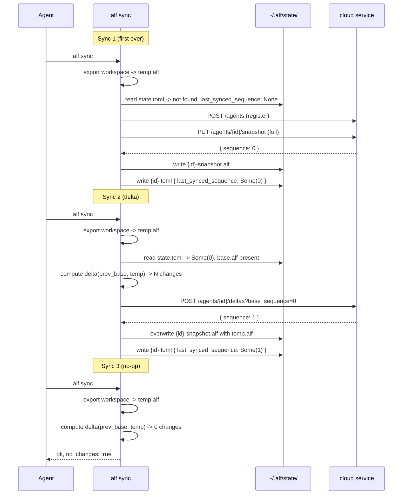
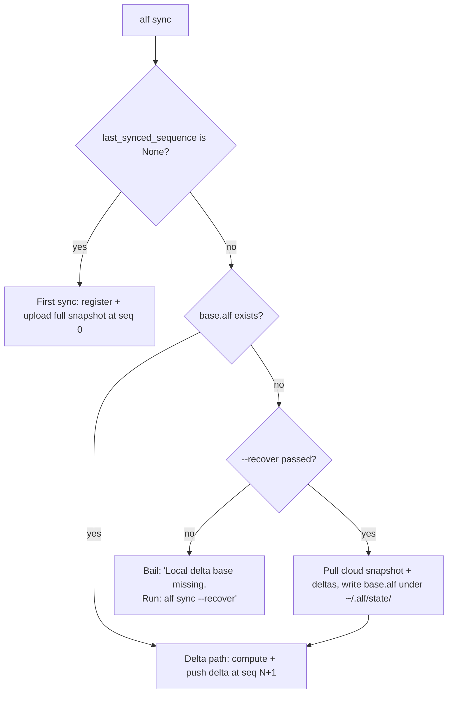

# How `alf sync` works

This is the canonical reference for how the ALF CLI synchronises an agent's
workspace with the cloud sync service. It documents the data model, the
happy path, and every reachable corner case — particularly the cases that
arise on **ephemeral runtimes** where the rootfs may have been wiped between
boots.

If you are debugging a production sync failure, jump straight to the
[Ephemeral-runtime cases](#ephemeral-runtime-cases-the-primary-failure-surface)
or the [Operator runbook](#operator-runbook).

## 1. Overview and vocabulary

| Term | Meaning |
| --- | --- |
| **Agent** | A persistent identity (a UUID) whose memory and context are tracked in the cloud. |
| **Workspace** | The directory the runtime reads and writes (e.g. `/config/.openclaw/workspace`). The live source of truth for the agent's state. |
| **Snapshot** | A complete `.alf` archive of the agent's state at a point in time. |
| **Delta** | An `.alf-delta` archive describing the *changes* since a base snapshot. |
| **Sequence** | A monotonically increasing `u64` assigned by the cloud service. The first snapshot is at sequence 0; each subsequent delta advances the sequence by 1. |
| **Local base** | A copy of the last successfully synced snapshot, kept under `~/.alf/state/{agent_id}-snapshot.alf`. Used as the base for computing the next delta. |
| **State file** | `~/.alf/state/{agent_id}.toml`. Records the sequence number of the last successful sync, plus informational metadata. |

## 2. The model in one sentence

Per-agent sync state is one optional number — `last_synced_sequence: Option<u64>` — kept in the state file. The local base snapshot is a separate file. Branch decisions in `alf sync` are made by reading the sequence (primary input) and checking whether the base file exists on disk (secondary input). Nothing else gates control flow.

## 3. The two stores

There are two independent on-disk stores that `alf sync` cares about:

- **The workspace.** This is where the runtime stores everything the agent reads and writes — `SOUL.md`, `MEMORY.md`, daily logs, configuration, and so on. The workspace is the live, mutable source of truth for the agent's state. `alf` does not own this directory; the runtime does.
- **The ALF state directory** at `~/.alf/state/`. This is `alf`'s private bookkeeping. It contains, per agent, a small TOML file with the last sync's sequence number, and a frozen `.alf` archive that records what the agent's state looked like at the moment of the last successful sync. The frozen archive is used purely as the base for computing the next delta — it is never the source the agent reads from.

These two stores are decoupled. The workspace can be mutated freely between syncs; the state directory only changes when `alf sync` or `alf restore` runs.

## 4. Layout of `~/.alf/state/`

For each agent, exactly two files:

```
~/.alf/state/{agent_id}.toml             ← state file
~/.alf/state/{agent_id}-snapshot.alf     ← local base snapshot
```

A typical state file:

```toml
agent_id = "ee8c59c6-0424-4cd2-b89c-19d4609bbcdf"
last_synced_sequence = 7
last_synced_at = "2026-05-09T18:42:11Z"
```

`last_synced_sequence` is the sole sync-control variable. `last_synced_at` is **informational metadata**: written on every save, displayed by `alf help status`, and propagated into delta manifests as `base_timestamp`. It is **not read by any control flow** and exists only for human audit trails.

If the state file does not exist, the agent has never completed a sync (sequence is `None`). If the state file exists but the `-snapshot.alf` next to it is missing, the local base is incomplete — `alf sync` will refuse to push a delta until the base is reconstructed; see [`--recover`](#9-what---recover-does-and-does-not).

## 5. The happy path



## 6. Cloud-side semantics

The CLI talks to two relevant endpoints in [`agent-life-service/lambda-snapshot-sync/src/handlers.rs`](../../agent-life-service/lambda-snapshot-sync/src/handlers.rs):

- `PUT /v1/agents/:id/snapshot` (and the presigned variant) — uploads a full snapshot. The server reads the agent's current `latest_sequence` and writes the new snapshot at that sequence. It then updates `latest_snapshot_seq` to that value.
- `POST /v1/agents/:id/deltas?base_sequence=N` — pushes a delta. The server validates the base sequence, writes the delta at `latest_sequence + 1`, and advances `latest_sequence`.
- `GET /v1/agents/:id/restore` — returns the latest snapshot URL plus all deltas with `sequence > latest_snapshot_seq`. The CLI merges these into a complete archive locally.

Two consequences worth noting:

- **The first snapshot is at sequence 0.** Because `agents.latest_sequence` initialises to 0 and `insert_snapshot` reuses that value. So `last_synced_sequence == 0` does **not** mean "fresh agent" — it means "first snapshot has been uploaded." That ambiguity is exactly why `last_synced_sequence` is an `Option<u64>` in the state file rather than a bare `u64`. `None` is "never synced"; `Some(0)` is "synced once."
- **Re-uploading a snapshot advances the snapshot floor.** If the CLI uploads a fresh snapshot when the cloud already has deltas, `latest_snapshot_seq` jumps forward and the older deltas become invisible to `restore` (the server filters `sequence > latest_snapshot_seq`). This is why `alf sync` never silently re-uploads a snapshot when the local state suggests a delta should be possible.

## 7. State transitions in `sync.rs`



The decision is sequential. Read `last_synced_sequence` first; that alone decides whether this is a first sync. If not, check `base.alf` on disk to choose between the delta path and the recovery path.

A short branch table:

| `last_synced_sequence` | base.alf | Branch |
| --- | --- | --- |
| `None` | (any) | First sync. If base.alf happens to exist, it gets overwritten. |
| `Some(N)` | present | Delta sync at `base_sequence: N`. |
| `Some(N)` | absent | Bail with `alf sync --recover` message; or, with `--recover`, pull cloud → write base.alf → delta. |

> **`Some(0)` is normal.** It is the post-first-sync state, not a fresh state. The `Option` wrapper carries the disambiguation that older code tried (and failed) to encode in `last_synced_at`.

### Atomic-write invariant

Both `restore` and `sync` write `base.alf` **before** the state file. This means `state.toml` exists ⇒ `base.alf` was written successfully at the moment of the last write. Violations of this invariant can only come from:

- (a) running an old CLI that did not persist `base.alf` (the pre-`5511a15` `alf restore` was the dominant such bug);
- (b) external deletion of `base.alf` after the fact;
- (c) the two files living on filesystems with different durability guarantees.

All three present to `sync` as "state.toml present + base.alf absent" and route to the same recovery path.

## 8. Ephemeral-runtime cases (the primary failure surface)

Ephemeral runtimes (Fly machines without `persist_rootfs`, the most common production deployment) are the dominant caller of `alf sync`. They invoke it from three places, none of which can pass interactive flags:

- The Fly suspend exec (returns `409 alf_sync_failed` to the caller on non-zero exit).
- The shutdown handler trap (runs `alf sync` on SIGTERM).
- Boot-time `alf restore` (non-fatal on failure).

Below, every reachable combination of disk state at the time `alf sync` runs.

### E1 — Cold start, cloud has nothing for this agent

- Boot: `alf restore` returns "no snapshot available," exits non-zero, `50-configure-runtime` logs a warning and continues.
- Disk after boot: state.toml absent, base.alf absent. `last_synced_sequence: None`.
- First `alf sync` (suspend or shutdown): **first-sync branch** — registers the agent, uploads the workspace as a snapshot at sequence 0, writes both files. Saved state: `last_synced_sequence: Some(0)`.
- Outcome: correct.

### E2 — Cold start, cloud has prior data

- Boot: `alf restore` succeeds, populates the workspace, writes `base.alf` and state.toml atomically.
- Disk after boot: state.toml present (with `last_synced_sequence: Some(N)`), base.alf present.
- `alf sync`: **delta branch** — picks up any changes the agent has made since boot.
- Outcome: correct. **This is the expected production happy path.**

### E3 — Cold start, restore skipped (no `AGENT_ID` env)

- Boot: `50-configure-runtime` logs `phase=alf_restore_skip reason=no_AGENT_ID`. Workspace stays empty.
- Disk after boot: state.toml absent, base.alf absent. `last_synced_sequence: None`.
- `alf sync`: would take the **first-sync branch** if invoked. **This is dangerous if there is existing cloud data for this agent.** Guard: when `register_agent` returns 409 (agent already exists), `alf sync` warns and requires `--force-first-sync` to proceed. Default is to bail.
- Outcome after guard: correct (bails cleanly; an operator must intervene with either `alf restore` first or `--force-first-sync`).

### E4 — Pre-`5511a15` restore on this rootfs (the failing log)

This is the case behind the production failure that motivated this work.

- Boot: an older CLI's `alf restore` populated the workspace and wrote state.toml (`last_synced_sequence: Some(0)`), but did **not** write `base.alf`.
- Disk after boot: state.toml present, base.alf absent.
- `alf sync` before this work: crashed with `Failed to read previous snapshot at /config/.alf/state/{id}-snapshot.alf: No such file or directory`.
- `alf sync` now: sees `last_synced_sequence: Some(0)` (not a first sync), checks `local_base_exists` (false), bails with a clear actionable error pointing to `alf sync --recover`. The Fly suspend handler surfaces this as 409 with the message in the body.
- Migration path: an operator runs `alf sync --recover` once via Fly exec. Recovery pulls the cloud snapshot and deltas, materialises `base.alf` under `~/.alf/state/`, then proceeds as a normal delta sync. Subsequent syncs take E2.
- Outcome: deterministic, no data loss, requires one explicit recovery operation per affected runtime.

### E5 — Suspend → start cycle (no rootfs reset)

- State preserved in place. Disk: state.toml + base.alf both present.
- `alf sync`: delta branch. Same as E2.

### E6 — Stop → start cycle, ephemeral rootfs

- Rootfs wiped. Boot runs `alf restore` again. Reduces to E1 or E2 depending on whether the agent has any cloud data yet.

### E7 — 409 on `push_delta`

- Cloud has advanced past our `last_synced_sequence` (e.g. a parallel runtime synced for the same agent).
- `push_delta` returns 409 with the cloud's latest sequence in a header.
- The CLI surfaces this; the operator should `alf restore` before retrying.

### E8 — Multiple agents in `~/.alf/state/`

- More than one `*.toml` under the state directory.
- Commands that need an agent ID (`restore`, `purge`) require `-a <agent-id>` to disambiguate. `resolve_agent_id` enforces this.

## 9. What `--recover` does (and does not)

`alf sync --recover` does exactly one thing beyond a normal sync: when the local base is missing, it calls the cloud's `restore` endpoint, merges the snapshot and any deltas, and writes the result to `~/.alf/state/{agent_id}-snapshot.alf`. It does **not** touch the workspace.

If you need to repopulate the workspace itself from the cloud (e.g. you have a fresh container with an empty `/config/.openclaw/workspace`), use `alf restore`, not `alf sync --recover`.

If `--recover` is passed but the local base is already healthy, the flag is a no-op.

The recovery emits a distinct human-readable progress line and includes `"recovered": true` in the JSON output, so suspend logs can distinguish a recovered sync from a regular delta sync.

## 10. Operator runbook

### Symptom: suspend fails with `alf_sync_failed: ... Failed to read previous snapshot ...`

This is **E4**. The local base file is missing while the state file claims a previous sync.

1. Connect to the runtime: `fly ssh console -a <app>` (or `fly machine exec`).
2. Run: `HOME=/config alf sync --recover -r openclaw -w /config/.openclaw/workspace`.
3. Verify: `ls -l /config/.alf/state/` should now show both `{agent_id}.toml` and `{agent_id}-snapshot.alf`.
4. Re-trigger suspend; it should succeed.

If this happens repeatedly on freshly spawned runtimes, the runtime image is still on a CLI version that does not write the snapshot during `alf restore`. Re-bake from a current image.

### Symptom: `alf sync` says "Agent already exists in cloud (HTTP 409). Refusing to upload as first sync."

This is the **E3 guard**. Either the agent ID was reused under a different identity, or `alf restore` was skipped at boot. Decide:

- The local workspace is the truth (you really do want to overwrite the cloud): `alf sync --force-first-sync ...`.
- The cloud is the truth: `alf restore` first, then `alf sync` normally.

### Symptom: `alf sync` returns 409 from `push_delta`

This is **E7**. Another writer advanced the agent's sequence in the cloud.

1. `alf restore -r <runtime> -w <workspace>`.
2. `alf sync -r <runtime> -w <workspace>`.

### Symptom: nothing wrong, just want to inspect state

`alf help status --human` lists the tracked agents, their `last_synced_sequence`, `last_synced_at`, and whether the local base is present.
